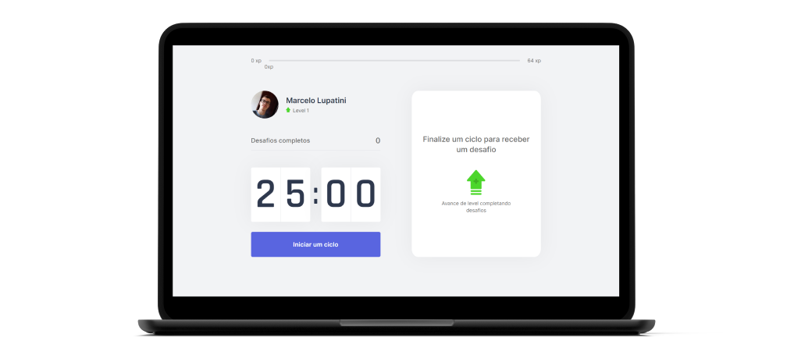
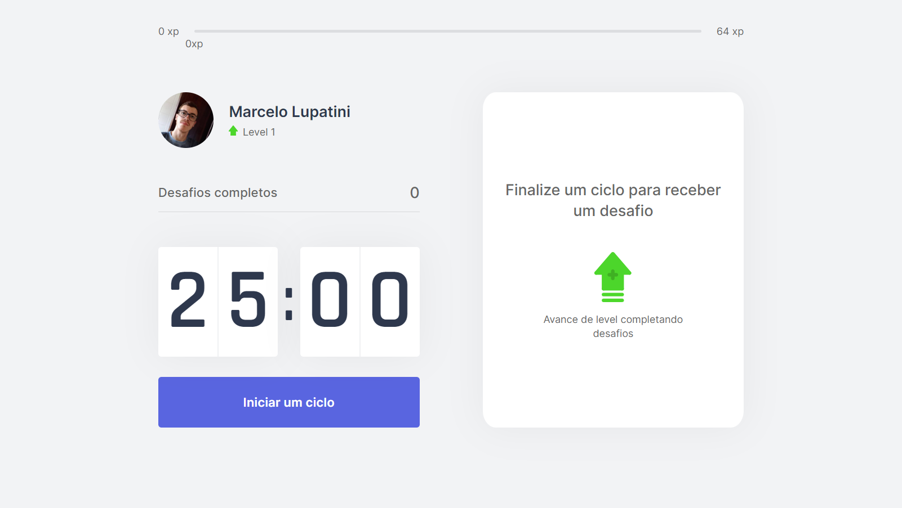
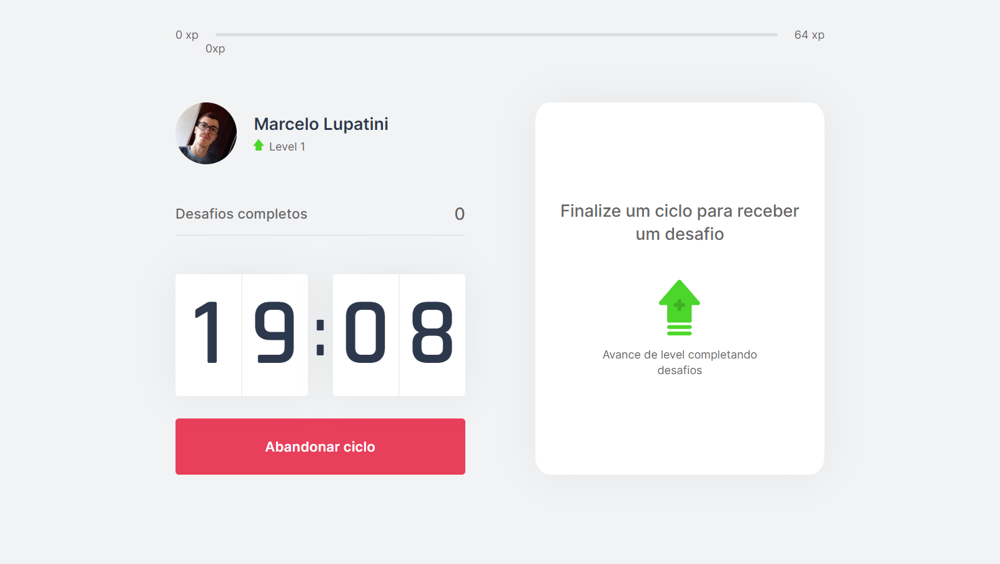
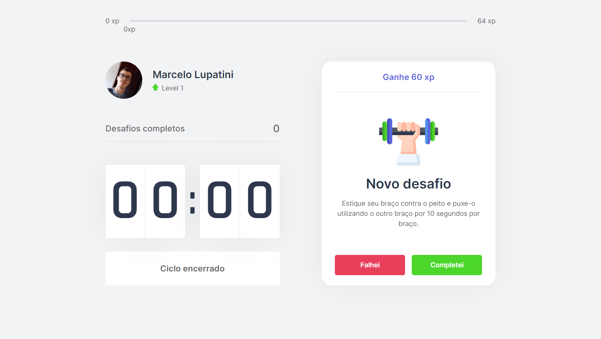

<h1 align="center">
  
</h1>

<h4 align="center"> 
  Next Level Week #04 - Move.it
</h4>

  
  
  
  
  
  

## Índice

* [Índice](#índice)
* [Sobre](#sobre)
  * [Conceito](#conceito)
  * [Tecnologias](#principais-tecnologias-utilizadas)
* [Instalação local](#instalação-local)
* [Créditos](#créditos)
* [Licença](#licença)

## Sobre

O projeto foi desenvolvido na trilha React da quarta edição do evento Next Level Week proporcionado pela empresa [Rocketseat](https://rocketseat.com.br/). Baseou-se em um layout elaborado no Figma.

### Conceito

O Move.it é um site com vários desafios para movimentar o corpo dentro de intervalos durante longas jornadas sentado; seja estudando, seja trabalhando. Esses intervalos seguem a [Técnica Pomodoro](https://pt.wikipedia.org/wiki/T%C3%A9cnica_pomodoro). Com isso, seu corpo se mantém saudável e forte.

Conforme você realiza os desafios você vai ganhando experiência e atinge novos níveis. Bora se exercitar?

  
  
  

### Principais tecnologias utilizadas

O sistema foi desenvolvido em TypeScript. É composto de 3 partes:

- [Next](https://nextjs.org/)
- [React](https://react.dev/)
- [JavaScript Cookie](https://www.npmjs.com/package/js-cookie)

## Instalação local

Passos para atingir isso podem ser conferidos <a href="./INSTALLATION.md">neste arquivo</a>.

## Créditos

Credito a elaboração do modelo do banner deste documento e do banner social ao autor desconhecido desta [postagem](https://mckups.com/pixel-4-and-pixelbook-go-mockup/) no site [Mckups](https://mckups.com). Foi adaptado por mim de acordo com as características deste projeto.

## Licença

Este projeto está sob a licença MIT. Para maiores detalhes acesse o <a href="./LICENSE.md">arquivo de licença</a>.
